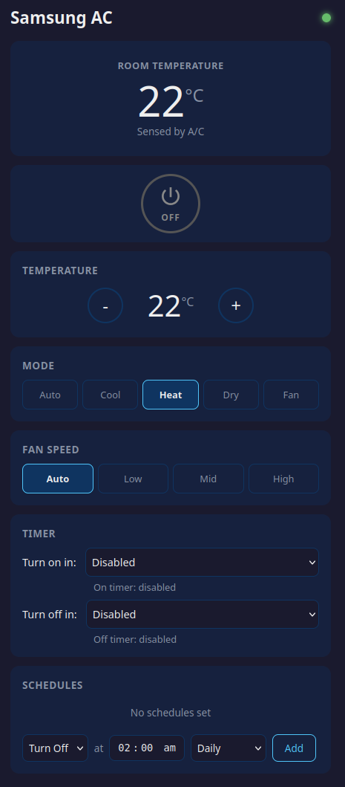

# Samsung AC Local WiFi Control

Local WiFi control for Samsung ducted air conditioners with WiFi adapters (MIM-H02 and similar).
Provides a mobile-friendly web interface for older Samsung Smart Air Conditioner / CAC WiFi
adapters whose original Android app is no longer supported on newer devices.

This project is unofficial and is not affiliated with Samsung.



## Features

- Power on/off, mode (Auto/Cool/Heat/Dry/Fan), temperature, fan speed, swing direction
- App-side one-shot timers (turn on/off in N minutes)
- App-side scheduling (e.g. "turn off at 2am on weeknights")
- App-side schedules persist across app/server restarts via `schedules.yaml`
- Network discovery to find your AC automatically
- Mobile-friendly responsive UI - works great on phones
- No cloud, no login, no internet required - 100% local

## Quick Start

```bash
# Clone the repo, then enter the project directory.
cd samsung-ac-local

# Install dependencies
pip install -r requirements.txt

# Copy and edit the local configuration
cp config.example.yaml config.yaml

# Run the app
python -m samsung_ac

# Or with verbose logging
python -m samsung_ac -v
```

Then open http://localhost:8080 in your browser (or from your phone: http://YOUR_SERVER_IP:8080).

## Configuration

Copy `config.example.yaml` to `config.yaml`, then edit it:

```yaml
ac_host: "192.168.1.xxx"  # Your AC WiFi adapter's IP
ac_port: 2878
token: ""
web_port: 8080
```

If you don't know the AC's IP address, leave `ac_host` empty and use the "Scan Network" 
button in the web UI to discover it automatically.

App-side schedules and one-shot timers are saved in `schedules.yaml` beside `config.yaml`.
One pending on-timer and one pending off-timer can run at the same time; setting a new
on-timer only replaces the existing on-timer, and setting a new off-timer only replaces
the existing off-timer. They survive app/server restarts, but missed events are not
replayed if the server is off at the scheduled time.

## Finding Your AC's IP Address

The AC WiFi adapter should be connected to your home WiFi network. You can find its IP by:

1. Using the built-in network scanner in the web UI
2. Checking your router's DHCP client list
3. Running: `python -m samsung_ac.discovery`

## Supported Models

This works with Samsung HVAC units that use the MIM-H02 (or similar) WiFi adapter, 
communicating via TLS on port 2878. This includes many Samsung ducted and split systems 
from the 2013-2020 era.

Tested with an older Samsung ducted reverse-cycle system using a MIM-H02-style WiFi adapter.

## How It Works

The Samsung WiFi adapter exposes a TLS server on port 2878 that accepts XML commands.
This app connects directly to that adapter on your local network - no Samsung cloud 
services needed.

The adapter uses legacy TLS settings that modern OpenSSL rejects by default. This project
explicitly enables the older cipher settings required by these adapters.

## Security Notes

- The web UI has no built-in authentication.
- Run it only on a trusted local network.
- Do not expose the web port directly to the internet.
- Keep `config.yaml` private because it may contain your AC pairing token.

## Running as a Service

To run on boot on a Linux server, use the included `samsung-ac.service.example` as a
starting point:

```bash
sudo cp samsung-ac.service.example /etc/systemd/system/samsung-ac.service
sudo nano /etc/systemd/system/samsung-ac.service
sudo systemctl daemon-reload
sudo systemctl enable samsung-ac
sudo systemctl start samsung-ac
```

## Not Included

The original Samsung APK and any proprietary Samsung app assets are not included. This
project implements the local TLS/XML protocol directly.

## License

MIT License. See `LICENSE`.
